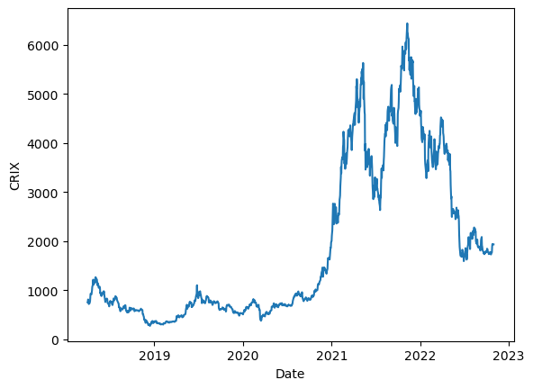

[](http://quantlet.de/)

## [](http://quantlet.de/) **Crix** [](http://quantlet.de/)

```yaml

Name of Quantlet : Crix
Published in : DEDA_2022_NYCU
Description : 
- plot of Royalton Crix index
Keywords :
- Cryptocurrency
- Time Series
- Crix
- Financial Markets
- Data Analysis
Datafile:
- CRIXgraphicdata.csv
Output :
- Crix.png
Submitted:  '13 Dec 2022'
Author : 
- 'David Alexander Behrens'

```



### [IPYNB Code: Crix.ipynb](Crix.ipynb)


automatically created on 2023-01-07