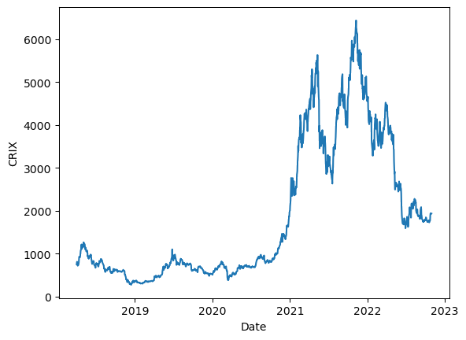
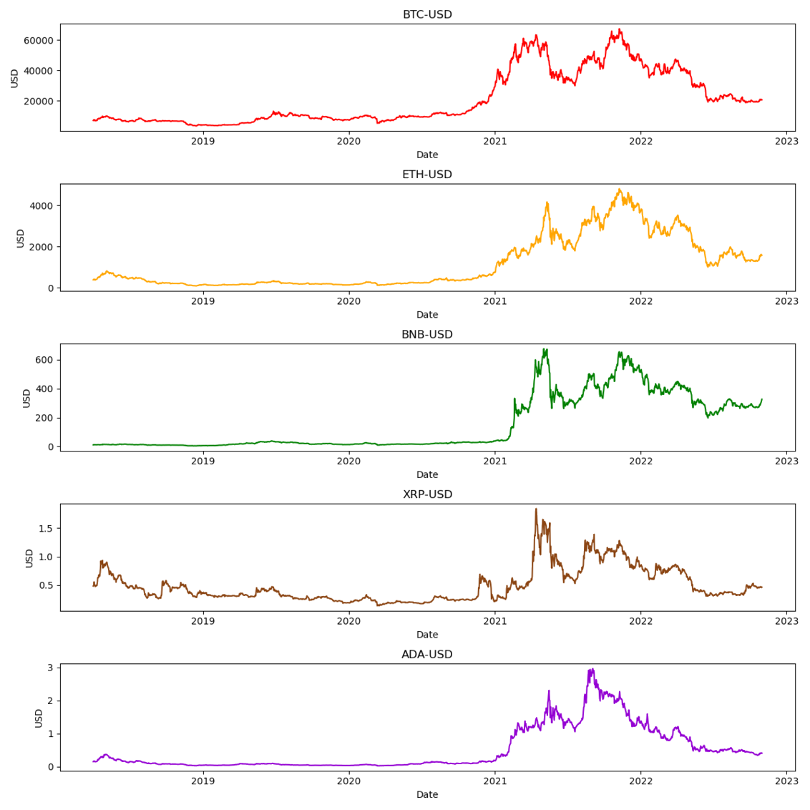
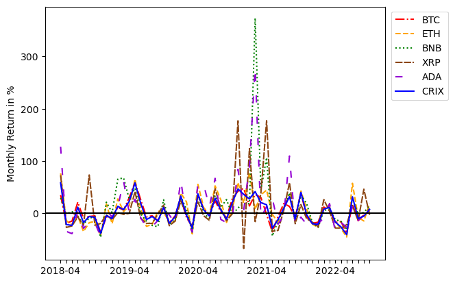

[](http://quantlet.de/)

## [](http://quantlet.de/) **Efficiency of cryptocurrency markets** [](http://quantlet.de/)

```yaml

Name of Quantlet : Efficiency of cryptocurrency markets
Published in : DEDA_2022_NYCU
Description : 
- Estimate CAPM coefficients using GMM
- test inefficiencies (violation of moment conditions) with J-test
- include a momentum factor in the analysis

Keywords :
- Cryptocurrency
- GMM
- CAPM
- Momentum
- Asset Pricing

Datafile:
- ADA-USD.csv
- BNB-USD.csv
- BTC-USD.csv
- ETH-USD.csv
- XRP-USD.csv
- PerformanceGraphExport.xls
- interest_rate_us.csv


Output :
- CRIX.png
- Coins.png
- monthly_r.png

Submitted:  '13 Dec 2022'


Author : 
- 'David Alexander Behrens'

```







### [IPYNB Code: Efficiency of cryptocurrency markets.ipynb](Efficiency of cryptocurrency markets.ipynb)


automatically created on 2023-01-07