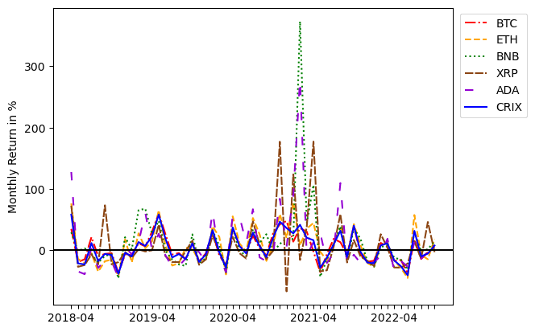

[](http://quantlet.de/)

## [](http://quantlet.de/) **monthly_returns** [](http://quantlet.de/)

```yaml

Name of Quantlet : monthly_returns
Published in : DEDA_2022_NYCU
Description : 
- plot of monthly returns of BTC, ETH, BNB, XRP, ADA and CRIX
Keywords :
- Cryptocurrency
- Time Series
- Financial Markets
- Monthly Returns
- Crix
- Bitcoin
- Ether
- Binance Coin
- Ripple
- Cardano
Datafile:
- mrgraphicdata.csv
Output :
- monthly_r.png
Submitted:  '13 Dec 2022'
Author : 
- 'David Alexander Behrens'

```



### [IPYNB Code: monthly_returns.ipynb](monthly_returns.ipynb)


automatically created on 2023-01-07