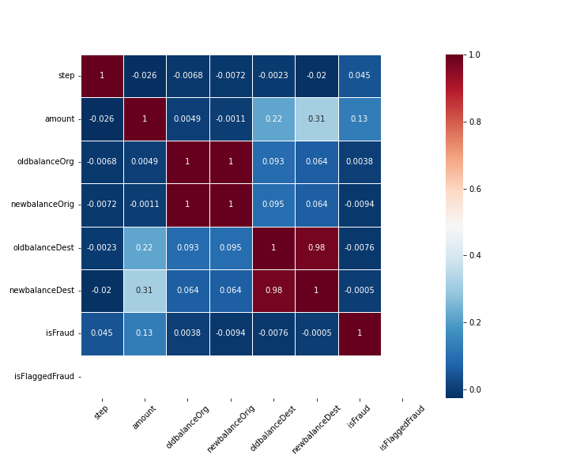
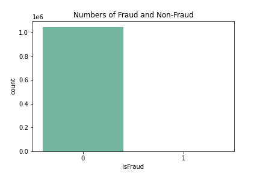
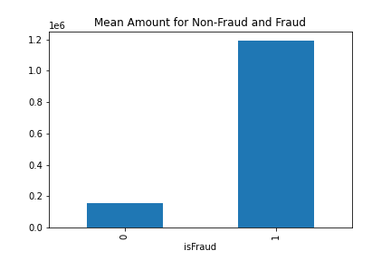
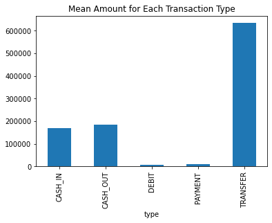
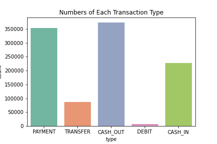
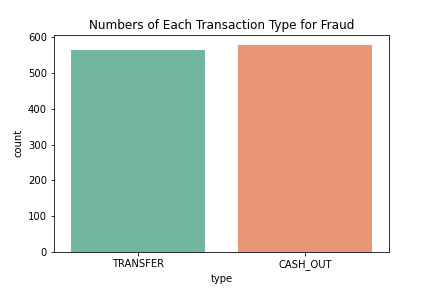

[](http://quantlet.de/)

## [](http://quantlet.de/) **Fraud_Detection_EDA** [](http://quantlet.de/)

```yaml

Name of Quantlet: 'Fraud_Detection_EDA'

Published in: 'DEDA class 2022'

Description: 'Exploratory analysis of data to extract the pattern of fraudulent activities.'
Submitted: '22 Nov 2022'

Keywords: 
- 'Fraud'
- 'EDA'
- 'Money laundering'
- 'Machine learning'
- 'OLS Regression'

Output:
- 'corrplot.png'
- 'fraud_count.png'
- 'type_count.png'
- 'type_count_fraud.png'
- 'mean_amount_fraud.png'
- 'mean_amount_type.png'


Author: 
- 'Wolfgang Karl Härdle'
- 'Jing-Xun Lin'
- 'David Jheng'
- 'Ying-Yu Chen'

```













### [IPYNB Code: Fraud_Detection_EDA.ipynb](Fraud_Detection_EDA.ipynb)


automatically created on 2022-12-02