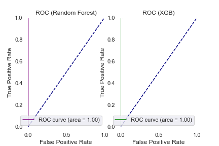
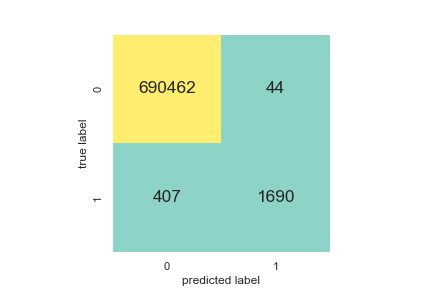
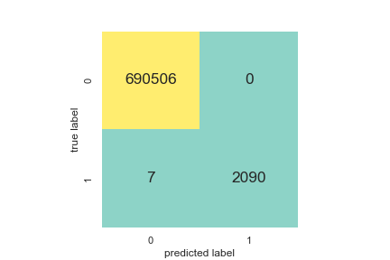
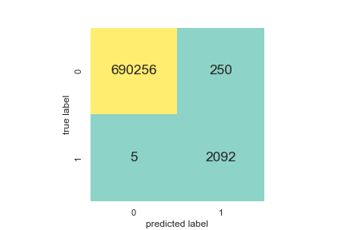
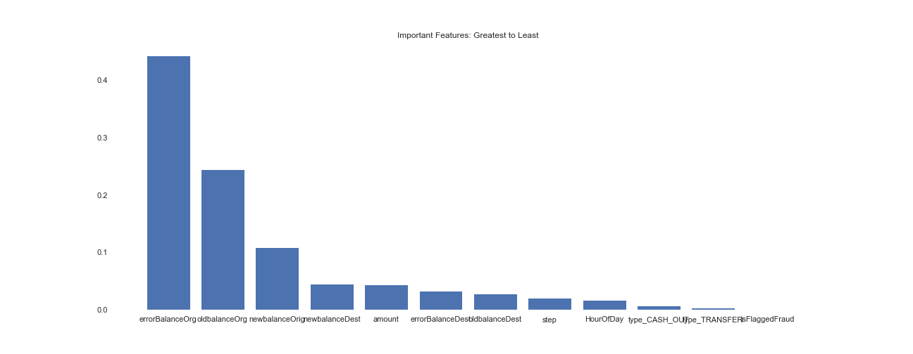

[](http://quantlet.de/)

## [](http://quantlet.de/) **Fraud_Detection_Model_Selection** [](http://quantlet.de/)

```yaml

Name of Quantlet: 'Fraud_Detection_Model_Selection'

Published in: 'DEDA class 2022'

Description: 'Use different models to correctly predict fraudulent and valid transactions.'
Submitted: '22 Nov 2022'

Keywords: 
- 'Fraud'
- 'Neural networks'
- 'Random forest'
- 'XGB trees'
- 'Money laundering'
- 'Machine learning'
- 'StandardScaler'

Output:
- 'AUC.png'
- 'importances.png'
- 'MLP.png'
- 'RandomForest.png'
- 'XGBtrees.png'

Author: 
- 'Jing-Xun Lin'
- 'David Jheng'
- 'Ying-Yu Chen'
```











### [IPYNB Code: Fraud_Detection_Model_Selection.ipynb](Fraud_Detection_Model_Selection.ipynb)


automatically created on 2022-12-02