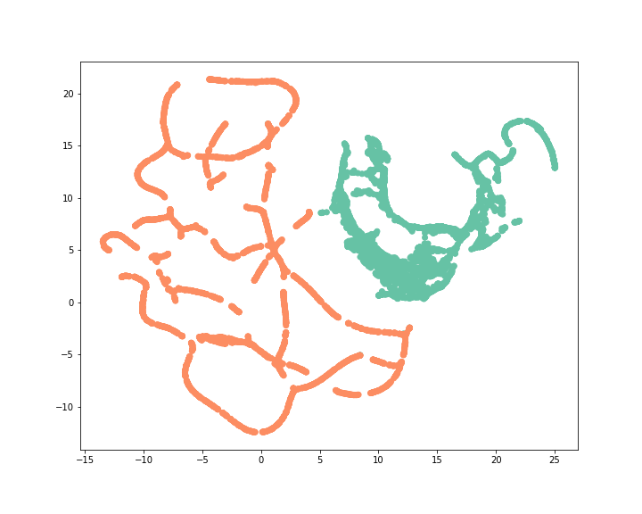

[](http://quantlet.de/)

## [](http://quantlet.de/) **Fraud_Detection_UMAP** [](http://quantlet.de/)

```yaml

Name of Quantlet: 'Fraud_Detection_UMAP'

Published in: 'DEDA class 2022'

Description: 'Using UMAP  to analysis the pattern of fraudulent activities.'
Submitted:  '22 Nov 2022'

Keywords: 
- 'Fraud'
- 'UMAP'
- 'Money laundering'
- 'Machine learning'
- 'StandardScaler'


Output:
- 'umap.png'

Author: 
- 'Wolfgang Karl Härdle'
- 'Jing-Xun Lin'
- 'David Jheng'
- 'Ying-Yu Chen'
```



### [IPYNB Code: Fraud_Detection_UMAP.ipynb](Fraud_Detection_UMAP.ipynb)


automatically created on 2022-12-02