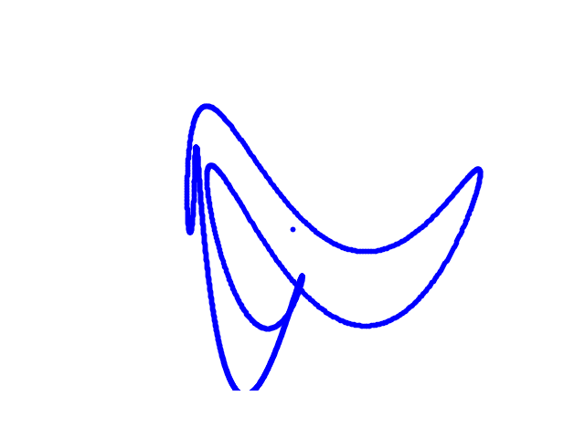

[](http://quantlet.de/)

## [](http://quantlet.de/) **DEDA_Class_2022_597654_Elegant_Rhino** [](http://quantlet.de/)

```yaml

Name of Quantlet: 'DEDA_Class_2022_597654_Elegant_Rhino'

Published in: 'DEDA class 2022'

Description: 'Use complex numbers as parameters to fit an elegant rhino. Creates an MP4 file of the elegant rhino.'

Submitted: '22 Jan 2023'

Keywords:
- 'Complex analysis'
- 'Fourier Transform'
- 'Elegant Rhino'
- 'Mathematical Art'
- 'Fitting Rhino'

Output:
- 'DEDA_Class_2022_597654_Elegant_Rhino.png'
- 'DEDA_Class_2022_597654_Elegant_Rhino.mp4'

Author:
- 'David Alexander Behrens'

```



### [IPYNB Code: DEDA_Class_2022_597654_Elegant_Rhino.ipynb](DEDA_Class_2022_597654_Elegant_Rhino.ipynb)


automatically created on 2023-02-07