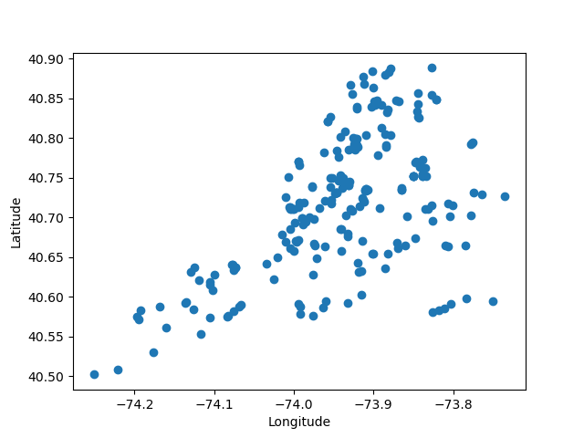

[](http://quantlet.de/)

## [](http://quantlet.de/) **DEDA_Class_2022_HW2_597654_DavidBehrens** [](http://quantlet.de/)

```yaml

Name of Quantlet: DEDA_Class_2022_HW2_597654_DavidBehrens

Published in: 'DEDA class 2022'

Description:
- Demonstrate getting data from webpage API and scraping
- Maping the location of electric vehicle fleet stations in New York City

Submitted: '23 Jan 2023'

Keywords:
- Web crawling
- Visualization
- Spatial
- Map
- Scatter plot


Output:
- 'New_York_EV_fleet_stations_scatter_raw.png'
- 'New_York_EV_fleet_stations.html'

Author : David Alexander Behrens

```



### [IPYNB Code: DEDA_Class_2022_HW2_597654_DavidBehrens.ipynb](DEDA_Class_2022_HW2_597654_DavidBehrens.ipynb)


automatically created on 2023-02-07