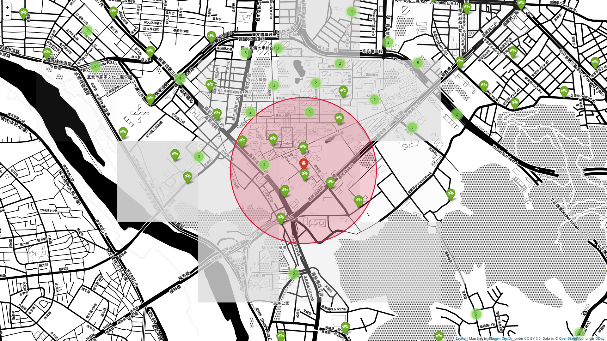

[](http://quantlet.de/)

## [](http://quantlet.de/) **HW2_TracyZhou_0453946_YoubikeLocation** [](http://quantlet.de/)

```yaml

Name of Quantlet : HW2_TracyZhou_0453946_YoubikeLocation

Published in : DEDA class 2022

Submitted: 22 Sep 2022

Description :
- Demonstrate getting data from webpage API and scraping data information from taipei public dataset
- Find the nearest avaiable youbike in taipei.

Keywords :
- Python
- Web Data
- Json
- Foilum
- map

Output:
- HW2_TracyZhou_0453946_YoubikeLocation.png
- HW2_TracyZhou_0453946_YoubikeLocation.html

Author : Tracy Zhou

```



### [IPYNB Code: HW2_TracyZhou_0453946_YoubikeLocation.ipynb](HW2_TracyZhou_0453946_YoubikeLocation.ipynb)


automatically created on 2022-10-13