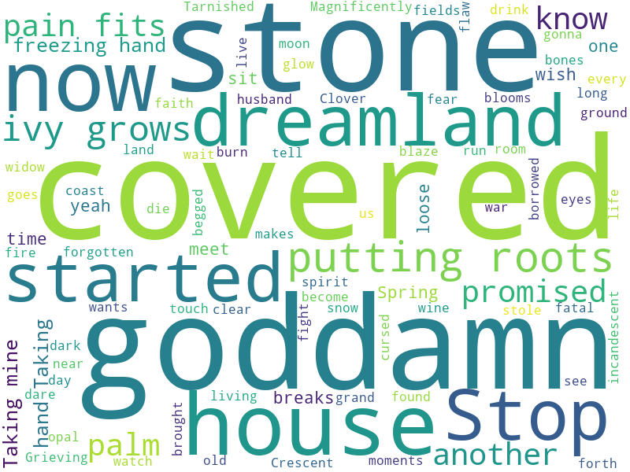

[](http://quantlet.de/)

## [](http://quantlet.de/) **DEDA_Class_2022_311707016_JingXun** [](http://quantlet.de/)

```yaml

Name of Quantlet: 'DEDA_Class_2022_311707016_JingXun'

Published in: 'DEDA class 2022'

Description: 'After getting the lyrics of a song, make a wordcloud to discover which kind of words used the most in the song.'

Submitted: '02 Oct 2022'

Keywords:
- 'WordCloud'
- 'Song'
- 'Lyrics'
- 'Stopwords'
- 'Word frequency'

Input:
- 'lyrics.txt'

Output:
- 'wordcloud.png'

Author: 'Jing-Xun Lin'

```



### PYTHON Code
```python

from PIL import Image
from wordcloud import WordCloud, STOPWORDS

text = open('lyrics.txt', encoding='utf-8').read()

stopwords = set(STOPWORDS)
stopwords.add('Oh')

wc = WordCloud(
    max_words = 1000,
    stopwords = stopwords,
    mode = 'RGBA',
    background_color = 'White',
    width=800,
    height=600
)

wc.generate(text)
wc.to_file('wordcloud.png')
```

automatically created on 2022-10-13