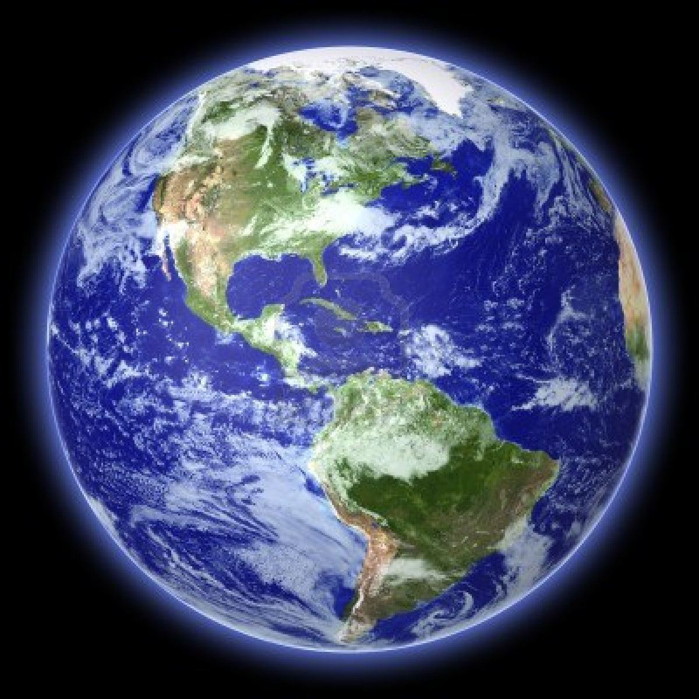

[](http://quantlet.de/)

## [](http://quantlet.de/) **HW2(Optionl)_311707020_Inyu_Word distribution_song_we are the world** [](http://quantlet.de/)

```yaml

Name of Quantlet: 'HW2(Optionl)_311707020_Inyu_Word distribution_song_we are the world'

Published in: 'DEDA class 2022'

Description: Make the word cloud by extracing the words from Michael Jackson's song "We are the word".
Submitted:  '07 Oct 2022'

Keywords : 
- 'We are the world'
- 'Michael Jackson'
- 'stopwords'
- 'cleantext'
- 'worldcloud'

Datafile:
- 'earth.png'
- 'we are the world.txt'

Output:
- 'Output_total.txt'
- 'we are the world.png'

Author: 
- 'Wolfgang Karl Härdle'
- 'Ying-Yu Chen'

```




### [IPYNB Code: HW2(Optionl)_311707020_Inyu_Word distribution_song_we are the world.ipynb](HW2(Optionl)_311707020_Inyu_Word distribution_song_we are the world.ipynb)


automatically created on 2022-11-04