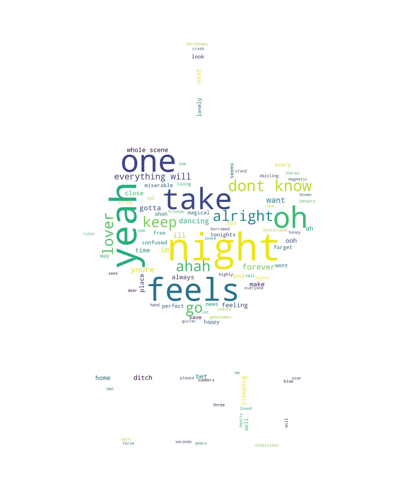

[](http://quantlet.de/)

## [](http://quantlet.de/) **HW2.1_311712023_Buris_heart** [](http://quantlet.de/)

```yaml

Name of Quantlet: HW2.1_311712023_Buris_heart  

Published in: DEDA_2022_NYCU

Description: Compare two Lover Songs with their frequency words and their topics (LDA)

Keywords: LDA, word cloud, topic modelling, Lover Song, word frequency

See also: LDA-DTM_NASDAQ, LDA-DTM_Shakespeare, LDA-DTM_Speech_Xijinping

Author: Buris Muangklang

Submitted:  28 SEP 2022

Output: wordcloud_heart.png, heatmap lover song.png

```


