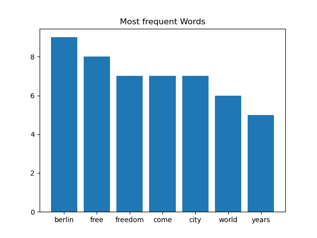
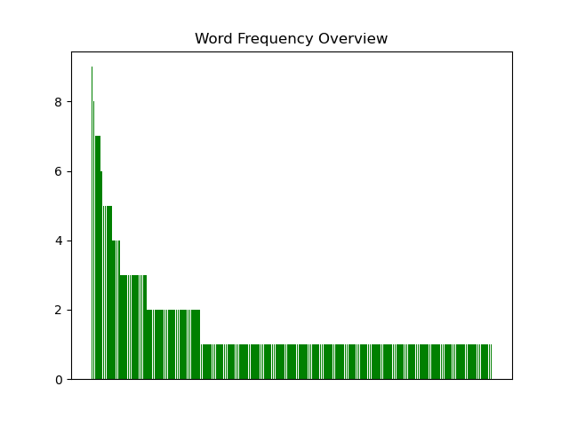
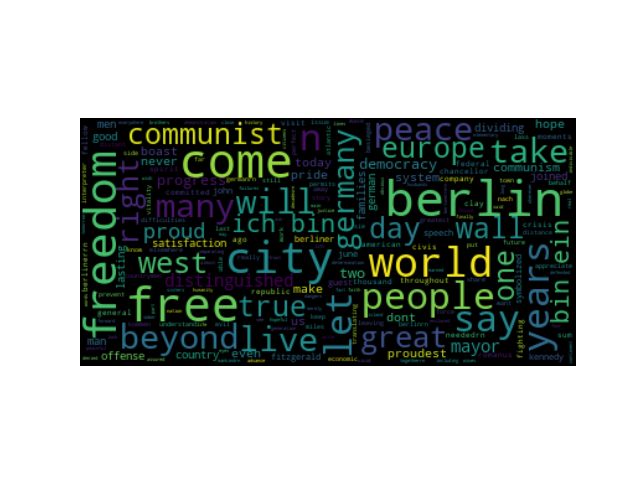

[](http://quantlet.de/)

## [](http://quantlet.de/) **DEDA_Class_2022_HW3_597654_DavidBehrens** [](http://quantlet.de/)

```yaml

Name of Quantlet: 'DEDA_Class_2022_HW3_597654_DavidBehrens'

Published in: 'DEDA class 2022'

Description: Python web scrapping and seniment analysis of John F. Kennedy's speech "Ich bin ein Berliner".

Submitted:  '24 Jan 2023'

Keywords : 
- 'Sentiment Analysis'
- 'wordcloud'
- 'Beautiful Soup'
- 'Word Frequency'
- 'Histogram of Words'

Output:
- 'FrequentWords.png'
- 'overview.png'
- 'wordcloud.png'
- 'Output.txt'


Author: 
- 'David Alexander Behrens'

```







### [IPYNB Code: DEDA_Class_2022_HW3_597654_DavidBehrens.ipynb](DEDA_Class_2022_HW3_597654_DavidBehrens.ipynb)


automatically created on 2023-02-07