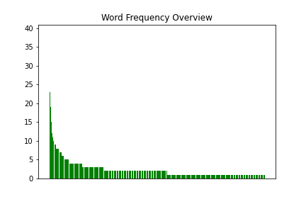
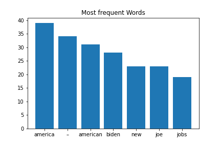

[](http://quantlet.de/)

## [](http://quantlet.de/) **HW3_Buris Muangklang_311712023_Sentiment** [](http://quantlet.de/)

```yaml

Name of Quantlet : HW3_Buris Muangklang_311712023_Sentiment
Published in : DEDA_2022_NYCU
Description :
- Demonstrate getting data from webpage API and scraping the speech of Donald Trump from CNN
- Introducing functional programming and object-oriented programming
Keywords :
- Python
- Web Data
- Json
- selenium
- sentiment
Datafile :
- Score_Buris_SpeechTrump.txt
- Output_Buris_TrumpSpeech.txt
Output :
- overview_Buris_TrumpSpeech.png
- plot_Buris_TrumpSpeech.png
Submitted:  '11 Oct 2022'
Author : Buris Muangklang

```





### PYTHON Code
```python

# -*- coding: utf-8 -*-
"""
Created on Tue Oct 31 17:57:07 2017

@author: Julian
"""

from selenium import webdriver
import matplotlib.pyplot as plt
import re
from nltk.corpus import stopwords
import os
import pysentiment as ps
#from wordcloud import WordCloud


#path_direct = os.getcwd()
#os.chdir(path_direct + '/pyning')
p = "C:/Users/toro_/OneDrive/Documents/Finance engineering/Week 2/HW3"
os.chdir(p)

from selenium.webdriver.common.by import By
# Start Selenium
browser = webdriver.Chrome()
url = "https://edition.cnn.com/2020/08/28/politics/donald-trump-speech-transcript/index.html"

# Extract text
browser.get(url)
id = "doc-tabs-full"
text = browser.find_element(By.XPATH,' //html/body/div[1]/section[3]/section[1]/section[1]/article/section/main/div[2]/div[1] ').text
browser.close()
browser.stop_client()

# find and delete <...> combinations
# find and delete /...> combinations
# Takes only lists as input
# Returns list as output

"""

def SearchAndReplaceSeq(html, opensign, closesign):
    
        openbool = False
        nText = range(len(text))
        
        for i in nText:
            
            print("i = ", i)
            print("outer loop")
            
            if text[i] in opensign:
                loc = opensign.index('<')
                openbool = True
                print("deleting ", text[i])  
                text[i] = "" # delete
                
                while openbool:         
                            print("inner loop")
                            
                            if text[i] != closesign[loc]:
                                print(i, "deleting ", text[i])  
                                text[i] = ""
                                i += 1
                            
                            else:
                                print(i, "deleting ", text[i])  
                                text[i] = ""
                                openbool = False
                                i += 1
                                                        
                

                #continue # switch to next mark, first one is always open

            else:
                print("keeping", text[i])
                print("outer loop down")
                continue #i += 1     
                
        return(text); 

                     
textout = SearchAndReplaceSeq(html = text, opensign = ['<', '/', '{'], closesign = ['>', '>', '}'])

s = "".join(textout)   

"""

# Some expressions still left
# Differ between quotes!
expression = "[()]|(\“)|(\”)|(\“)|(\”)|(\,|\.|-|\;|\<|\>)|(\\n)|(\\t)|(\=)|(\|)|(\-)|(\')|(\’)"
cleantextCAP = re.sub(expression, '', text)
cleantext = cleantextCAP.lower()       

# Count and create dictionary
dat = list(cleantext.split())
dict1 = {}
for i in range(len(dat)):
    print(i)
    word = dat[i]
    dict1[word] = dat.count(word)
    continue


# Filter Stopwords
import nltk
nltk.download('stopwords')
from nltk.corpus import stopwords
keys = list(dict1)
filtered_words = [word for word in keys if word not in stopwords.words('english')]
dict2 = dict((k, dict1[k]) for k in filtered_words if k in filtered_words)

#keys in stopwords.words("english")

# Resort in list
# Reconvert to dictionary

def valueSelection(dictionary, length, startindex = 0): # length is length of highest consecutive value vector
    
    # Test input
    lengthDict = len(dictionary)
    if length > lengthDict:
        return print("length is longer than dictionary length");
    else:
        d = dictionary
        items = [(v, k) for k, v in d.items()]
        items.sort()
        items.reverse()   
        itemsOut = [(k, v) for v, k in items]
    
        highest = itemsOut[startindex:startindex + length]
        dd = dict(highest)
        wanted_keys = dd.keys()
        dictshow = dict((k, d[k]) for k in wanted_keys if k in d)

        return dictshow;
    
dictshow = valueSelection(dictionary = dict2, length = 7, startindex = 0)

# Save dictionaries for wordcloud
text_file = open("Output_Buris_TrumpSpeech.txt", "w")
text_file.write(str(cleantext))
text_file.close()


# Plot
n = range(len(dictshow))
plt.bar(n, dictshow.values(), align='center')
plt.xticks(n, dictshow.keys())
plt.title("Most frequent Words")
plt.savefig("plot_Buris_TrumpSpeech.png")

# Overview
overview =  valueSelection(dictionary = dict2, length = 1000, startindex = 0)
nOverview = range(len(overview.keys()))
plt.bar(nOverview, overview.values(), color = "g", tick_label = "")
plt.title("Word Frequency Overview")
plt.xticks([])
plt.savefig("overview_Buris_TrumpSpeech.png")


# Sentiment Analysis
hiv4 = ps.HIV4()
tokens = hiv4.tokenize(cleantext)
score = hiv4.get_score(tokens)
print(score)

# Polarity
# Formula: (Positive - Negative)/(Positive + Negative)

# Subjectivity
# Formula: (Positive + Negative)/N


"""
# Wordcloud
inputWordcloud = str(dict2.keys())
# Generate a word cloud image
wordcloud = WordCloud(path.join("symbola.ttf")).generate(inputWordcloud)
plt.imshow(wordcloud, interpolation='bilinear')
plt.axis("off")

wordcloud2 = WordCloud(max_font_size=40).generate(inputWordcloud)
plt.figure()
plt.imshow(wordcloud2, interpolation="bilinear")
plt.axis("off")
plt.show()

dict2.index("would")
dict2.get("would")
dict2.keys()
"""


```

automatically created on 2022-10-21