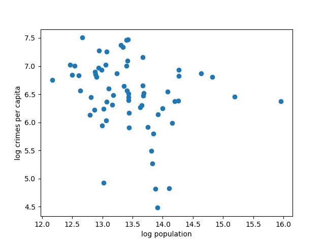

[](http://quantlet.de/)

## [](http://quantlet.de/) **DEDA_2022_HW5_597654_SpectralClustering** [](http://quantlet.de/)

```yaml

Name of Quantlet: 'DEDA_2022_HW5_597654_SpectralClustering'

Published in: 'DEDA class 2022'

Description: 'Spectral clustering for log population and log crime rate per capita'

Submitted: '22 Jan 2023'

Keywords:
- 'spectral clustering'
- 'clustering'
- 'langrange'
- 'scatter plot'
- 'data visualization'

Datafile: 'report.csv'

Output:
- 'log_population_log_crimes_per_capita_scatter.png'
- 'log_population_log_crimes_per_capita_clustered.png'

Author:
- 'David Alexander Behrens'

```




### [IPYNB Code: DEDA_2022_HW5_597654_SpectralClustering.ipynb](DEDA_2022_HW5_597654_SpectralClustering.ipynb)


automatically created on 2023-02-07