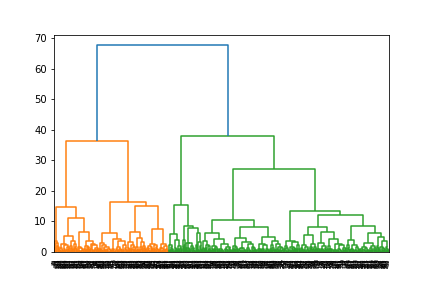
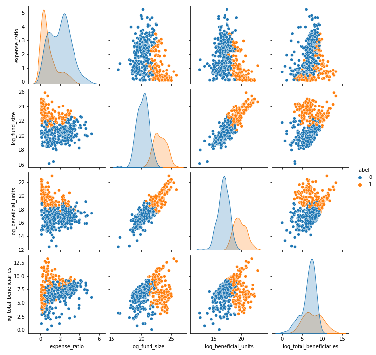
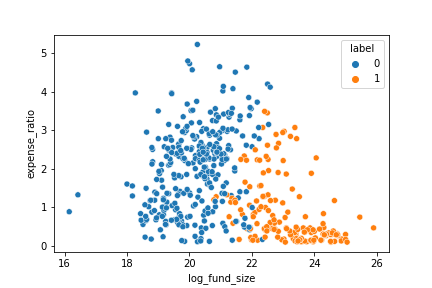

[](http://quantlet.de/)

## [](http://quantlet.de/) **DEDA_Class_2022_311707016_JingXun** [](http://quantlet.de/)

```yaml

Name of Quantlet: 'DEDA_Class_2022_311707016_JingXun'

Published in: 'DEDA class 2022'

Description: 'Using the fund data from Securities Investment Trust & Consulting Association of The R.O.C. to do the hierarchical clustering. Then observe the result of clustering for size and total expense ratio of the funds.'

Submitted: '16 Oct 2022'

Keywords:
- 'Hierarchical clustering'
- 'Fund'
- 'SITCA'
- 'Investment'
- 'Dendrogram'

Output:
- 'dendrogram.png'
- 'pairplot.png'
- 'size_and_expense.png'

Author: 'Jing-Xun Lin'
```







### [IPYNB Code: DEDA_Class_2022_311707016_JingXun.ipynb](DEDA_Class_2022_311707016_JingXun.ipynb)


automatically created on 2022-10-21