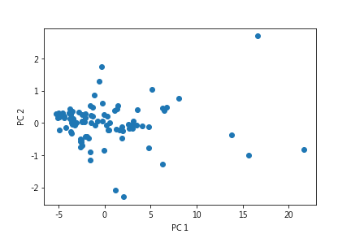
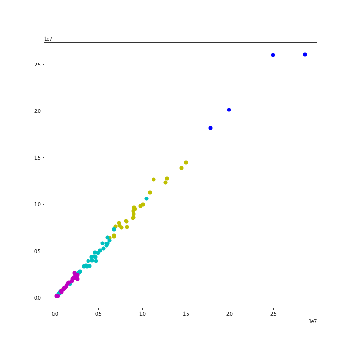
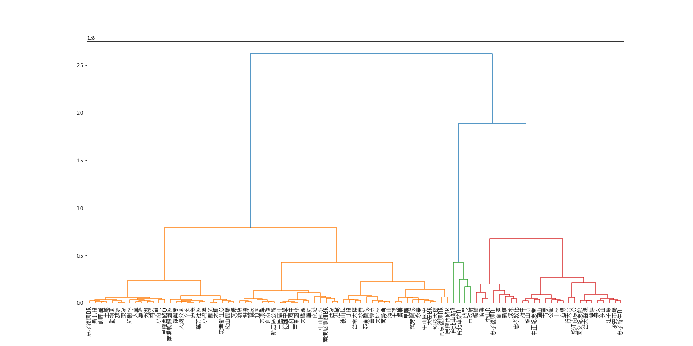

[](http://quantlet.de/)

## [](http://quantlet.de/) **DEDA_Class_2022_410707007_Tzu-Ying** [](http://quantlet.de/)

```yaml

Name of Quantlet: 'DEDA_Class_2022_410707007_Tzu-Ying'

Published in: 'DEDA class 2022'

Description: 'Using hierarchical clustering to group stations of Taipei MRT（Taipei Mass Rapid Transit）based on the passenger flow in a station from 2010 to 2021.' 

Datafile: 'Taipei MRT.csv'

Submitted: '21 Oct 2022'

Keywords: 
- 'Hierarchical Clustering'
- 'PCA'
- 'Dendrogram'
- 'Passenger flow'
- 'Taipei MRT'

Output: 
- "PCA.png"
- "dendrogram.png"
- "Visualisation.png"

Author: 
- 'TZU-YING TUNG'

```







### [IPYNB Code: DEDA_Class_2022_410707007_Tzu-Ying.ipynb](DEDA_Class_2022_410707007_Tzu-Ying.ipynb)


automatically created on 2022-10-26