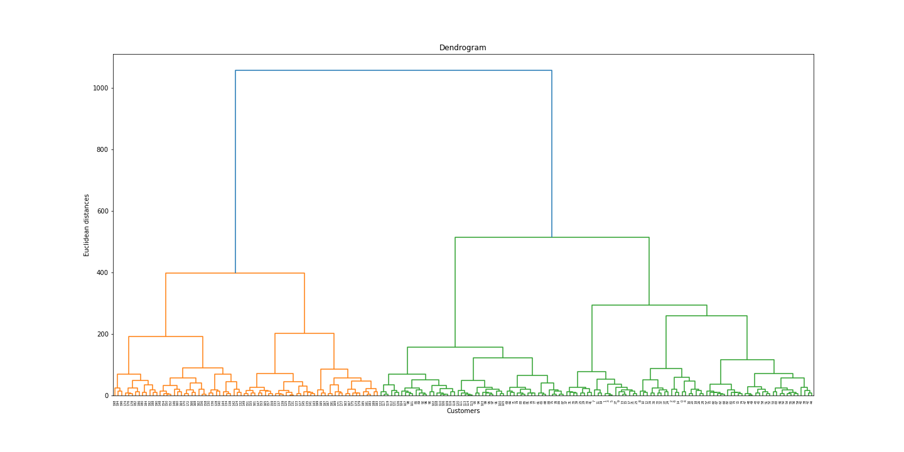
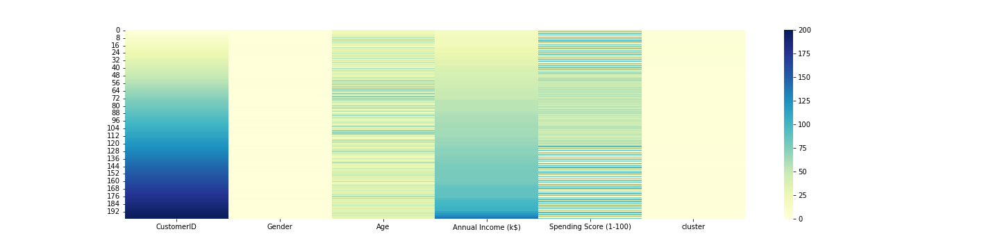

[](http://quantlet.de/)

## [](http://quantlet.de/) **DEDA_Class_2022_HW5_311707034_DavidJheng** [](http://quantlet.de/)

```yaml

Name of Quantlet: 'DEDA_Class_2022_HW5_311707034_DavidJheng'

Published in: 'DEDA class 2022'

Description: 'Hierarchical clustering for customer data.'

Submitted: '24 Oct 2022'

Keywords:
- 'hierarchical clustering'
- 'clustering'
- 'distance'
- 'dendrogram'
- 'data visualization'

Datafile: 'Mall_Customers.csv'

Output:
- 'Customers information (before cluster).png'
- 'Displot of Age, annual income and spending score.png'
- 'heatmap.png'
- 'Dendrogram.png'
- '3D Scatter.png'
- 'Clusters of Customers (Hierarchical Clustering Model).png'
- 'Segmented_customers.csv'

Author:
- 'David Jheng'

```


.png)

.png)






### [IPYNB Code: DEDA_Class_2022_HW5_311707034_DavidJheng.ipynb](DEDA_Class_2022_HW5_311707034_DavidJheng.ipynb)


automatically created on 2022-10-26