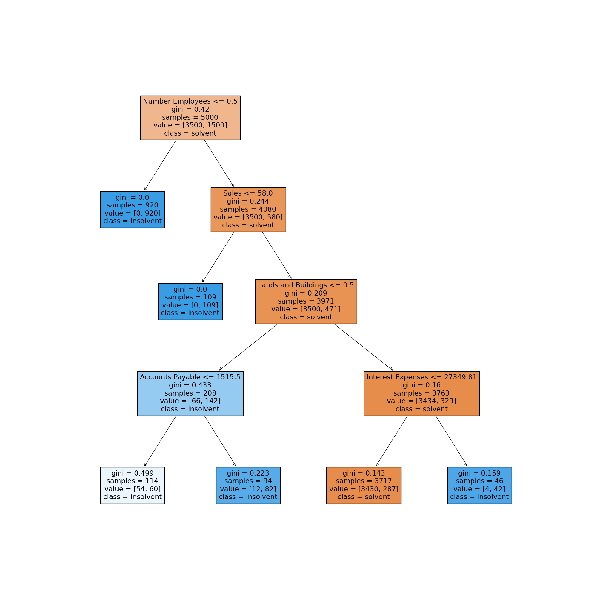

[](http://quantlet.de/)

## [](http://quantlet.de/) **DEDA_Class_2022_311707016_JingXun** [](http://quantlet.de/)

```yaml

Name of Quantlet: 'DEDA_Class_2022_311707016_JingXun'

Published in: 'DEDA class 2022'

Description: 'Using the CreditReform data, make a decision tree classifier and draw the tree plot.'

Submitted: '25 Oct 2022'

Keywords:
- 'Credit'
- 'Decision tree'
- 'Classifier'
- 'Tree'
- 'Insolvency'

Datafile:
- 'data_sample.csv'

Output:
- 'decision_tree_creditreform.png'

Author: 'Jing-Xun Lin'

```



### PYTHON Code
```python

import pandas as pd
import matplotlib.pyplot as plt
from sklearn.tree import DecisionTreeClassifier
from sklearn import tree

credit = pd.read_csv('data_sample.csv')
credit.columns = 'Cash, Inventories, Current Assets, Tangible Assets, Intangible Assets, Total Assets, Accounts Receivable, Lands and Buildings, Equity, Accrual for Pension Liabilities, Total Current Liabilities, Total Longterm Liabilities, Bank Debt, Accounts Payable, Sales, Amortization Depreciation, Interest Expenses, EBIT, Operating Income, Net Income, Increase Inventories, Increase Liabilities, Increase Cash, Number Employees, Insolvent'.split(', ')

X = credit.drop('Insolvent', axis=1)
y = credit['Insolvent']

DTClassifier = DecisionTreeClassifier(max_depth=4)
DTClassifier.fit(X, y)
fig = plt.figure(figsize=(20, 20))
tree.plot_tree(
    DTClassifier,
    feature_names=credit.columns,
    class_names=['solvent', 'insolvent'],
    filled=True
)

fig.savefig('decision_tree_creditreform.png', transparent=True)
```

automatically created on 2022-10-26