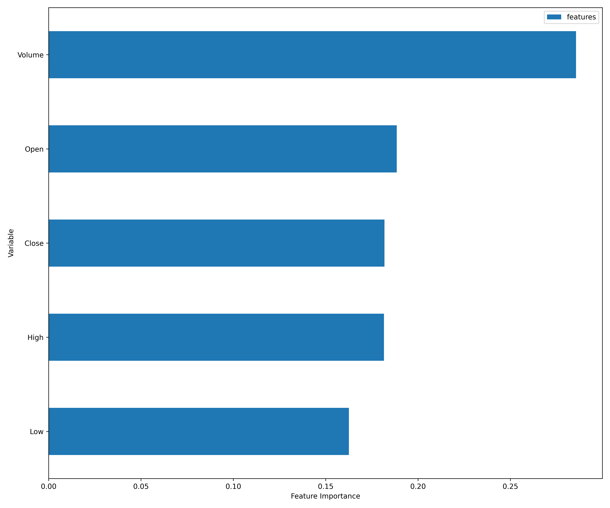

[](http://quantlet.de/)

## [](http://quantlet.de/) **DEDA_Class_2022_410707007_Tzu-Ying** [](http://quantlet.de/)

```yaml

Name of Quantlet: 'DEDA_Class_2022_410707007_Tzu-Ying'

Published in: 'DEDA class 2022'

Description: 'Using CART and Random Forest to predict the stock price direction of Apple' 

Submitted: '22 Oct 2022'

Datafile: 'data.csv'

Keywords: 
- 'CART'
- 'Random Forest'
- 'Importance analysis'
- 'ROC curve'
- 'Stock price direction'

Output: 
- "Decision Tree.png"
- "Importance.png"
- "ROC_Random Forest.png"
- "ROC_Decision Tree.png"

Author: 
- 'TZU-YING TUNG'

```





### [IPYNB Code: DEDA_Class_2022_410707007_Tzu-Ying.ipynb](DEDA_Class_2022_410707007_Tzu-Ying.ipynb)


automatically created on 2022-10-26