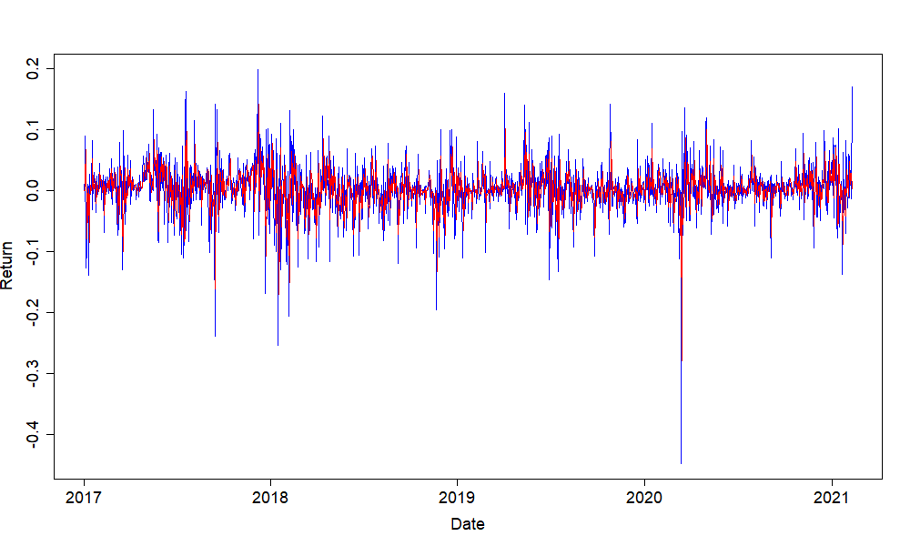

[](http://quantlet.de/)

## [](http://quantlet.de/) **DEDA_KalmanFilter_Tracy_0453946** [](http://quantlet.de/)

```yaml

Name of Quantlet: 'DEDA_KalmanFilter_Tracy_0453946'
Published in: 'DEDA class 2022'
Description: 'Use the CRIX data as an example to predict market return by Kalman filter' 
Keywords: 
- plot 
- Kalman Filter 
- predict
- estimation
- returns
- CRIX
- gif

Datafile: 'CRIX.csv'
Output:
- 'CRIXPrice_Kalman_0.03.png'
- 'CRIXPrice_Kalman_0.03.gif'
Author: 'Tracy Lei Zhou' 

```



### R Code
```r

rm(list = ls(all = TRUE))

# load package
libraries = c("FKF","quantmod","ggplot2","rjson","car","magick","gganimate","hrbrthemes","gifski","dplyr","viridis",
              "ggplot2","rjson","car","magick","gganimate","plotly")
lapply(libraries, function(x) if (!(x %in% installed.packages())) {
  install.packages(x)
})
lapply(libraries, library, quietly = TRUE, character.only = TRUE)

# people can change the wdir, it is the address where you put the results
wdir = 'F:/Tracy/NCTU/DEDA_2022/KF_modelres-main'
setwd(wdir)
dir.create("Results")
save = paste0(wdir, '/', "Results/")

file = paste0(wdir,"/CRIX.csv") #The data is loaded from https://thecrix.de
start = '2021-02-09'
end = '2017-01-02'


crix = read.csv(file = file, header = TRUE)
crix = as.data.frame(crix)
crix = crix[which(crix$date <= start),]
crix = crix[which(crix$date >= end),]
count = nrow(crix)
price = crix$price
return = c(0, diff(log(crix$price))) #observations

#Allocate space:
xhat = rep(0,count) #a posteri estimate at each step
P = rep(0,count)  #a posteri error estimate
xhatminus=rep(0,count) #a priori estimate
Pminus=rep(0,count) #a priori error estimate
K=rep(0,count) #gain

#initialise guesses: assume true_value=0, error is 1.0
xhat[1] <- return[1] 
P[1] <- 1
Q_Select = c(0.03) # could change to a range
#estimate of measurement variance
R = 0.03
for (Q in Q_Select){ 
  for (k in 2:count){
    #time update
    xhatminus[k] <- xhat[k-1]
    Pminus[k] <- P[k-1] + Q
    
    #measurement update
    K[k] = Pminus[k] / (Pminus[k] + R)
    xhat[k] = xhatminus[k] + K[k] * (return[k] - xhatminus[k])
    P[k] = (1-K[k]) * Pminus[k]
  }
  
  png(paste0(save,'CRIXPrice_Kalman_',Q,'.png'),width=1000,height=600,units="px",bg = "transparent")
  
  x= as.Date(crix$date)
  plot(x,return,col="blue",type="l",xlab = "Date",ylab ="Return",lwd = 1.5,cex.axis=1.5,cex.lab=1.5,cex.main=1.5)
  lines(x,xhatminus, col = "red",type="l",lwd = 1.5)
  
  dev.off()
}

# movie of parameter interactions
gif_plot = data.frame(date = crix$date, xhatminus = xhatminus, return = return)
gif1 <-  gif_plot %>% 
  ggplot(aes(x=xhatminus, y=return))  +
  geom_line(colour = 'grey') +
  geom_point() +
  theme_ipsum() +
  theme(panel.background = element_rect(fill = "transparent", colour = NA), 
        panel.grid.major = element_blank(), 
        panel.grid.minor = element_blank(), 
        axis.line = element_line(colour = "black")) +
  transition_reveal(as.Date(date)) +
  ggtitle("Date: {frame_along}")

#save .gif
animate(gif1, renderer = gifski_renderer(paste0(save,'CRIXPrice_Kalman_',Q,'.gif')), bg = "transparent",
        nframes = 100)

# MSE of different combination of Q and R
Q_Select = seq(from=0, to=0.03, by=0.0001)# could change to a range 0.001
#estimate of measurement variance
R_Select = seq(from=0, to=0.03, by=0.0001)

Result = matrix(nrow = length(Q_Select),ncol =length(R_Select))
for (i in 1 : length(Q_Select)){ #row number
  timestart<-Sys.time()
  for (j in 1 : length(R_Select)){ #Column number
    Q = Q_Select[i]
    R = R_Select[j]
    xhat = rep(0,count) #a posteri estimate at each step
    P = rep(0,count)  #a posteri error estimate
    xhatminus=rep(0,count) #a priori estimate
    Pminus=rep(0,count) #a priori error estimate
    K=rep(0,count) #gain
    
    #initialise guesses: assume true_value=0, error is 1.0
    xhat[1] <- return[1] 
    P[1] <- 1
    
    for (k in 2:count){
      #time update
      xhatminus[k] <- xhat[k-1]
      Pminus[k] <- P[k-1] + Q
      
      #measurement update
      K[k] = Pminus[k] / (Pminus[k] + R)
      xhat[k] = xhatminus[k] + K[k] * (return[k] - xhatminus[k])
      P[k] = (1-K[k]) * Pminus[k]
    }
    Result[i,j] = mean((return - xhatminus)^2)
  }
  timeend<-Sys.time()
  runningtime<-timeend-timestart
  print(paste0(timeend, " runing ", runningtime," finish ", as.character(Q)))
}

plot_Result = list(Q = Q_Select, R = R_Select, MSE= Result)
p <- plot_ly(x = plot_Result$Q, y = plot_Result$R, z = plot_Result$MSE)
#add_heatmap(p)
add_contour(p) #%>% layout(plot_bgcolor='rgb(0,0,0)')


```

automatically created on 2023-02-07