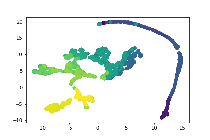

[](http://quantlet.de/)

## [](http://quantlet.de/) **DEDA_Class_2022_410707007_Tzu-Ying** [](http://quantlet.de/)

```yaml

Name of Quantlet: 'DEDA_Class_2022_410707007_Tzu-Ying'

Published in: 'DEDA class 2022'

Description: 'Using UMAP and t-SNE to perform dimension reduction on Taiwan Index 50 data from 6 dimensions to 2 dimensions.' 

Datafile: '0050.TW.csv'

Submitted: '27 Nov 2022'

Keywords: 
- 'UMAP'
- 't-SNE'
- 'PCA'
- 'Taiwan 50 Index'
- 'Dimension Reduction'

Output: 
- "UMAP_plot.png"
- "t-SNE_plot.png"
- "PCA_plot.png"

Author: 
- 'TZU-YING TUNG'

```





### [IPYNB Code: DEDA_Class_2022_410707007_Tzu-Ying.ipynb](DEDA_Class_2022_410707007_Tzu-Ying.ipynb)


automatically created on 2022-12-02