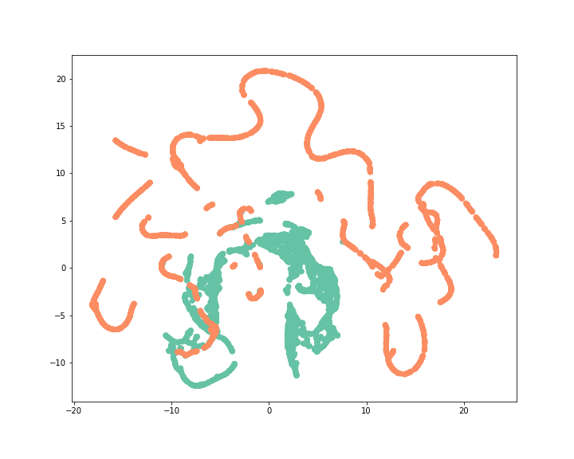

[](http://quantlet.de/)

## [](http://quantlet.de/) **DEDA_Class_2022_HW9_311707020_InyuChen** [](http://quantlet.de/)

```yaml

Name of Quantlet: 'DEDA_Class_2022_HW9_311707020_InyuChen'

Published in: 'DEDA class 2022'

Description: 'Using UMAP to reduce the dimensionality of the fraud detection data.'
Submitted:  '12 Jan 2023'

Keywords: 
- 'UMAP'
- 'fraud detection'
- 'Dimensionality reduction'
- 'sklearn'
- 'seaborn'

Datafile: 'sampling_data.csv'

Output:
- 'umap.png'

Author: 
- 'Ying-Yu Chen'
```



### [IPYNB Code: DEDA_Class_2022_HW9_311707020_InyuChen.ipynb](DEDA_Class_2022_HW9_311707020_InyuChen.ipynb)


automatically created on 2023-02-07