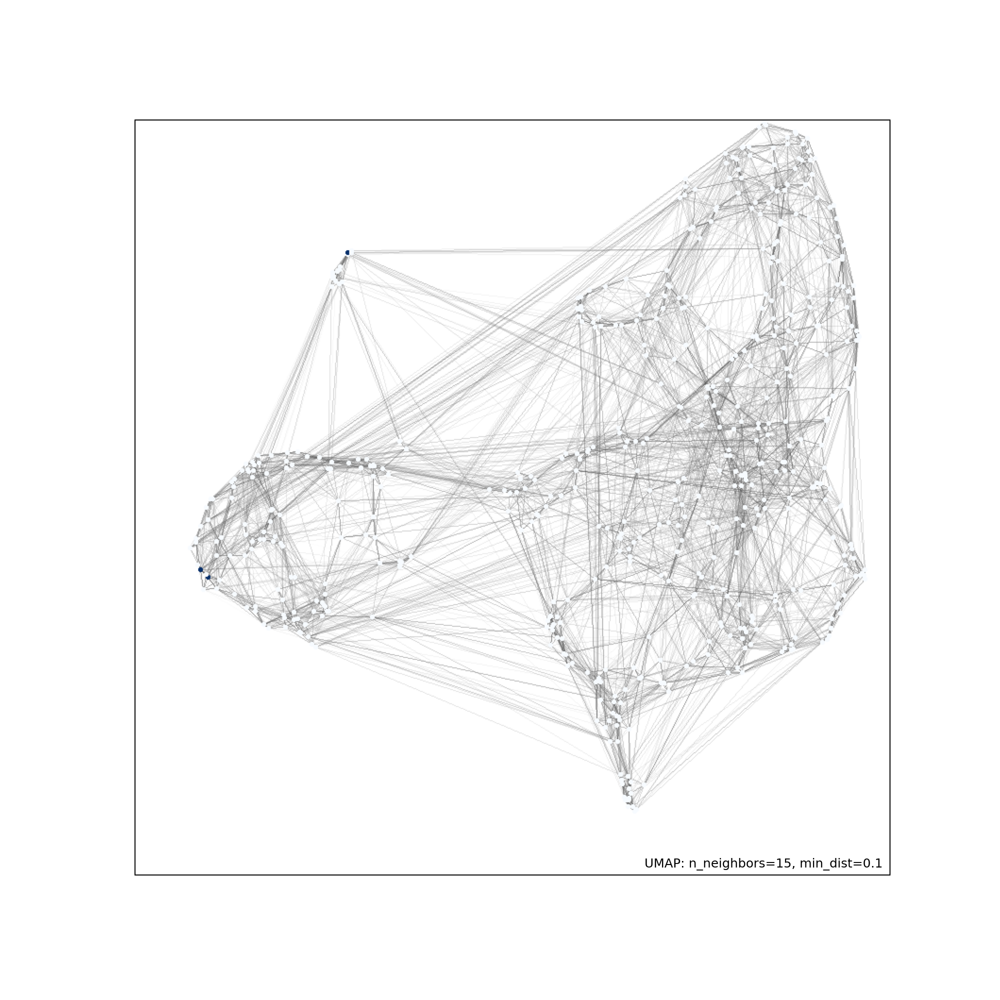

[](http://quantlet.de/)

## [](http://quantlet.de/) **DEDA_PFIZERUMAP_Youcef.Tahari** [](http://quantlet.de/)

```yaml

Name of Quantlet : DEDA_PFIZERUMAP_Youcef.Tahari
Published in : DEDA_2022_NYCU
Description : 
 - Study the relationship between press release and market performance with the case of Pfizer during the pandemic.
 - use UMAP to reduce dimension and conduct clustering. 
Keywords :
 - data visualization
 - dimensiuon reduction
 - UMAP
 - press release
 - Pfizer
Output :
 - Pfizer_umap.png
 - Pfizer_umap2.png
Author : 
 - 'Youcef Tahari'

```




### [IPYNB Code: DEDA_PFIZERUMAP_Youcef.Tahari.ipynb](DEDA_PFIZERUMAP_Youcef.Tahari.ipynb)


automatically created on 2023-02-18