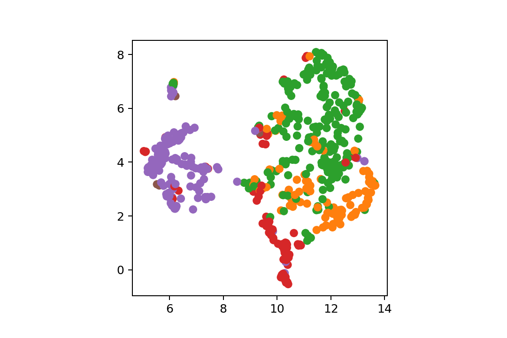
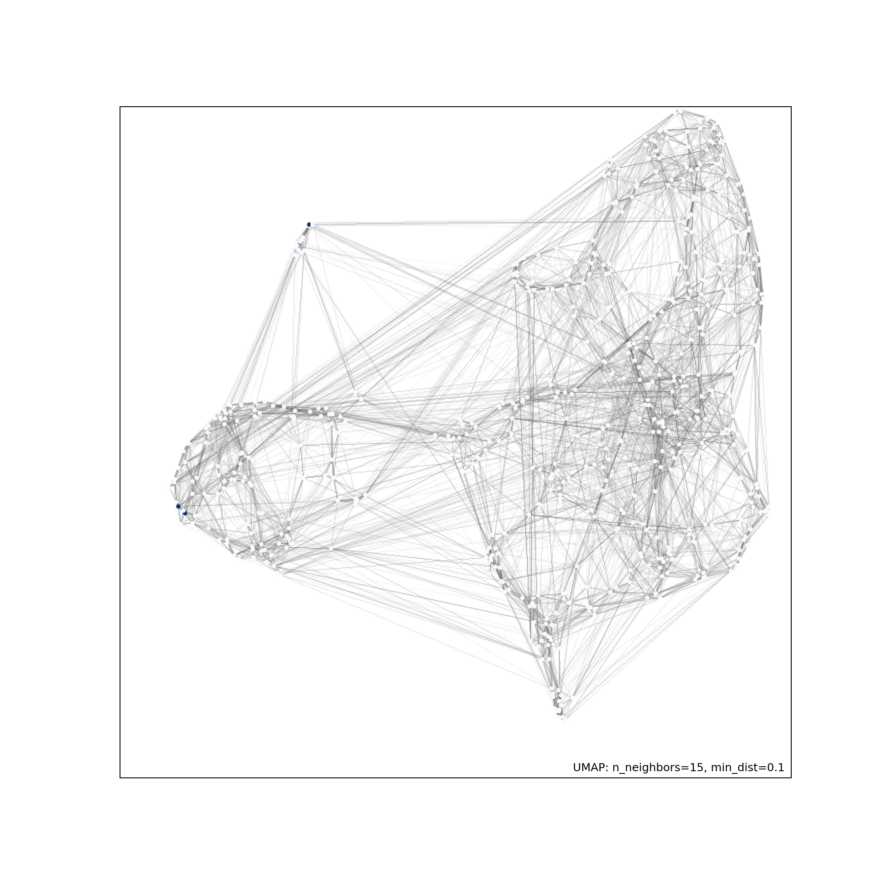

[](http://quantlet.de/)

## [](http://quantlet.de/) **DEDA_UMAP_Tracy_0453946** [](http://quantlet.de/)

```yaml

Name of Quantlet : DEDA_UMAP_Tracy_0453946
Published in : DEDA_2022_NYCU
Description : 
- Study the relationship between press release and market performance with the case of Pfizer during the pandemic.
- use UMAP to reduce dimension and conduct clustering. 
Keywords :
- data visualization
- dimensiuon reduction
- UMAP
- press release
- Pfizer
Datafile:
- Pfizer_data.csv
OutPut :
- Pfizer_umap.png
- Pfizer_umap2.png
Author : 
- 'Tracy Lei Zhou'

```





### PYTHON Code
```python

# -*- coding: utf-8 -*-
"""
Created on Mon Dec  5 15:52:19 2022

@author: Tracy Zhou
"""

import os
import pandas as pd
import matplotlib.pyplot as plt
import seaborn as sns
from sklearn.preprocessing import StandardScaler
import umap

# check directory
os.getcwd()
direct = os.getcwd()
#df.to_csv(direct + '/Pfizer_Press.csv')

df = pd.read_csv("Pfizer_data.csv").dropna()
df = df[['Positive','Negative','Polarity','Subjectivity','tag_n','trends', 'vary','jump','return', 'vol','year','win']]
df['tag_n'] = df['tag_n'].astype(int)
#df.head()


data = pd.read_csv("Pfizer_data.csv").dropna()
data = data[['vol','vary','jump','return','Positive','Negative','Polarity','Subjectivity','tag_n','trends']]
#data.head()
data = StandardScaler().fit_transform(data)
reducer = umap.UMAP(random_state=30)
embedding = reducer.fit_transform(data)
plt.scatter(
    embedding[:, 0],embedding[:, 1],
    #c = np.arange(embedding.shape[0]),
    c=[sns.color_palette()[x] for x in df.tag_n]
)
plt.axis('square')
plt.savefig("Pfizer_umap.png", transparent = True, dpi=180)


data = pd.read_csv("Pfizer_data.csv").dropna()
data = data[['vol','vary','jump','return','positive','negative','Polarity','Subjectivity','tag_n','trends']]
#print(data)
digits = StandardScaler().fit_transform(data)
mapper = umap.UMAP().fit(digits.data)
#print(mapper)
import umap.plot
umap.plot.connectivity(mapper, show_points=True)
plt.savefig("Pfizer_umap2.png", transparent = True, dpi=180)

from PIL import Image
image = Image.open('Pfizer_umap2.png')
image = image.convert('RGBA')
print(image.mode)
# Transparency
newImage = []
for item in image.getdata():
    if item[:3] == (255, 255, 255):
        newImage.append((255, 255, 255, 0))
    else:
        newImage.append(item)
image.putdata(newImage)
image.save('Pfizer_umap2.png')
print(image.mode, image.size)
```

automatically created on 2023-02-07