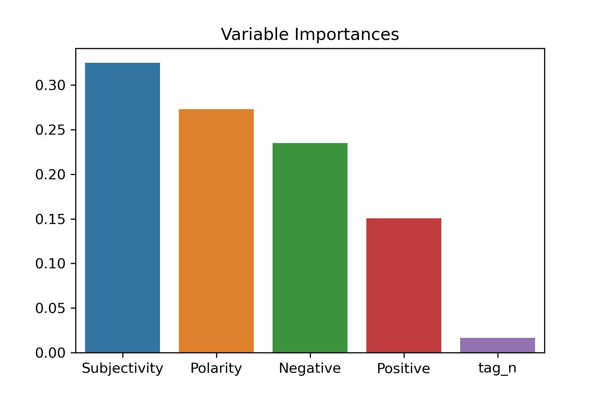
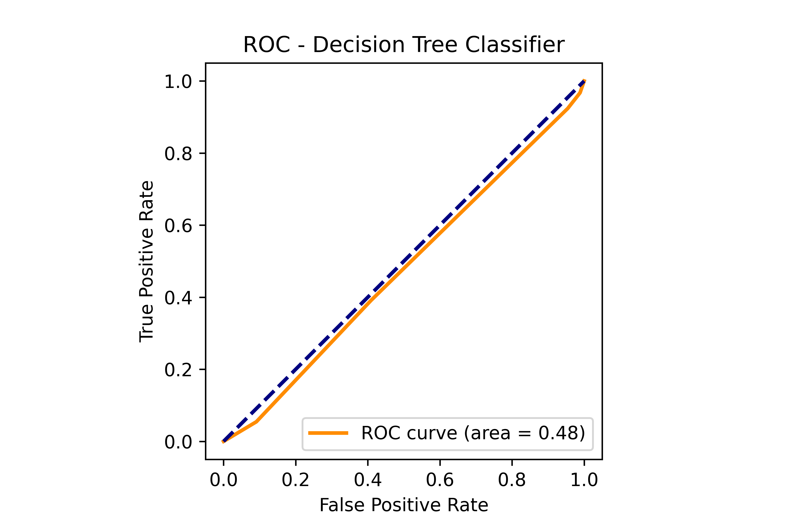
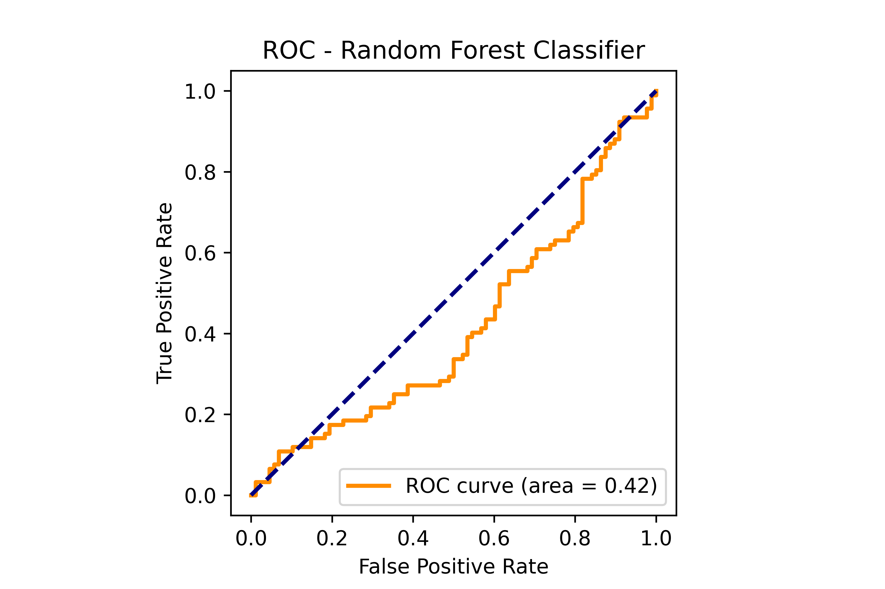

[](http://quantlet.de/)

## [](http://quantlet.de/) **Pfizer_RandomForest** [](http://quantlet.de/)

```yaml

Name of Quantlet : Pfizer_RandomForest
Published in : DEDA_2022_NYCU
Description : 
- Study the relationship between press release and market performance with the case of Pfizer during the pandemic.
- Step 4: predit the win rate by using sentiment score. (Data is in the main folder)
Keywords :
- sentiment scores
- market return
- decision tree
- random forest
- data visualization
- predition 
Input: 
- Pfizer_data.csv
OutPut :
- Pfizer_Decision_Tree.png
- Pfizer_RF_feature_importance.png
- Pfizer_ROC_DecisionTree.png
- Pfizer_ROC_RandomForest.png
Submitted:  '05 Dec 2022'
Author : 
- 'Tracy Zhou'
- 'Youcef Tahari'
- 'Buris Muangklang'
- 'Wolfgang Karl Härdle'

```








### PYTHON Code
```python

# -*- coding: utf-8 -*-
"""
Created on Mon Dec  5 16:13:37 2022

@author: Tracy Zhou
"""

# pip install pydot
import os
import pandas as pd
from sklearn.model_selection import train_test_split, GridSearchCV
from sklearn.ensemble import RandomForestClassifier
from sklearn.tree import export_graphviz
from sklearn.metrics import confusion_matrix, roc_curve, auc
import matplotlib.pyplot as plt
import matplotlib.image as mpimg
import numpy as np
import pydot
from sklearn import tree

%matplotlib inline

# check directory
os.getcwd()
#direct = os.getcwd()

df = pd.read_csv("Pfizer_data.csv").dropna()
df = df[['Positive','Negative','Polarity','Subjectivity','tag_n','win']]
#print(df)
X = df.drop('win', axis=1)
y = df['win']
df.head()


from sklearn.tree import DecisionTreeClassifier
clf = DecisionTreeClassifier(random_state=0, max_depth = 4)
clf.fit(X, y)
fig = plt.figure(figsize=(25,20))
_ = tree.plot_tree(clf, 
                   feature_names=df.columns,  
                   class_names=["win", "lose"],
                   filled=True)
fig.savefig("Pfizer_Decision_Tree.png", dpi=600, transparent=True)


X_train, X_test, y_train, y_test = train_test_split(
    X, 
    y,
    test_size=0.33, # ratio of data that is used for testing
    random_state=42,
    stratify = y # Keeps the ratio of the labels in train and test the same as in the initial data
)
import math
n_feature = len(df.columns)
rf = RandomForestClassifier(
    max_features=math.ceil(n_feature**0.5), # Number of randomly picked features for split 
    random_state=42, # Seed for random number generator
    oob_score=True, # Out of Bag accuracy score
    bootstrap=True # 
)
param_grid = {
    'max_depth': np.arange(3,7, 1),
    'n_estimators': [50, 100, 150, 200, 250],
    'max_features': np.arange(3,n_feature,3)
}
grid_search = GridSearchCV(
    estimator=rf, # RandomForestClassifier to be optimized
    param_grid=param_grid, # parameter grid
    cv=4, # cross validation split
    n_jobs=-1, # setting for parallization, -1: use all processors
    verbose=1,
    refit=True # Refit estimator using best found parameters
)
grid_search.fit(X_train,y_train)
print(grid_search.best_params_)
rf_ = grid_search.best_estimator_
print('The train accuracy: %.4f'%rf_.score(X_train,y_train))
print('The test accuracy: %.4f'%rf_.score(X_test,y_test))
pd.DataFrame(confusion_matrix(y_test, rf_.predict(X_test)), 
             index=["win", "lose"], columns=["win", "lose"])


feature_imp = pd.DataFrame(rf_.feature_importances_,
                           index=df.columns[:-1],columns=['features']).sort_values('features', ascending=False)
feature_imp['feature'] = feature_imp.index
feature_imp.columns =['value','feature']
#print(feature_imp)
import seaborn as sns
sns.barplot(data = feature_imp, x='feature',y='value')
plt.xlabel('')
plt.ylabel('')
plt.title('Variable Importances')
plt.savefig('Pfizer_RF_feature_importance.png', dpi=300, transparent=True)


y_score = rf_.fit(X_train, y_train).predict_proba(X_test)
# Compute ROC curve and ROC area for each class
fpr = dict()
tpr = dict()
roc_auc = dict()
for i in range(2):
    fpr[i], tpr[i], _ = roc_curve(y_test[:], y_score[:, i])
    roc_auc[i] = auc(fpr[i], tpr[i])
# Compute micro-average ROC curve and ROC area
fpr["micro"], tpr["micro"], _ = roc_curve(y_test, y_score[:,1])
roc_auc["micro"] = auc(fpr["micro"], tpr["micro"])
plt.figure()
lw = 2
plt.plot(
    fpr[1],
    tpr[1],
    color="darkorange",
    lw=lw,
    label="ROC curve (area = %0.2f)" % roc_auc[1],
)
plt.plot([0, 1], [0, 1], color="navy", lw=lw, linestyle="--")
plt.xlim([0.0, 1.0])
plt.ylim([0.0, 1.05])
plt.xlabel("False Positive Rate")
plt.ylabel("True Positive Rate")
plt.title("ROC - Random Forest Classifier")
plt.legend(loc="lower right")
plt.axis('square')
plt.savefig('Pfizer_ROC_RandomForest.png', dpi=600, transparent=True)
plt.show()


y_score_clf = clf.fit(X_train, y_train).predict_proba(X_test)
# Compute ROC curve and ROC area for each class
fpr = dict()
tpr = dict()
roc_auc = dict()
for i in range(2):
    fpr[i], tpr[i], _ = roc_curve(y_test[:], y_score_clf[:, i])
    roc_auc[i] = auc(fpr[i], tpr[i])
# Compute micro-average ROC curve and ROC area
fpr["micro"], tpr["micro"], _ = roc_curve(y_test, y_score_clf[:, 1])
roc_auc["micro"] = auc(fpr["micro"], tpr["micro"])
plt.figure()
lw = 2
plt.plot(
    fpr[1],
    tpr[1],
    color="darkorange",
    lw=lw,
    label="ROC curve (area = %0.2f)" % roc_auc[1],
)
plt.plot([0, 1], [0, 1], color="navy", lw=lw, linestyle="--")
plt.xlim([0.0, 1.0])
plt.ylim([0.0, 1.05])
plt.xlabel("False Positive Rate")
plt.ylabel("True Positive Rate")
plt.title("ROC - Decision Tree Classifier")
plt.legend(loc="lower right")
plt.axis('square')
plt.savefig('Pfizer_ROC_DecisionTree.png', dpi=600, transparent=True)
plt.show()

```

automatically created on 2022-12-07