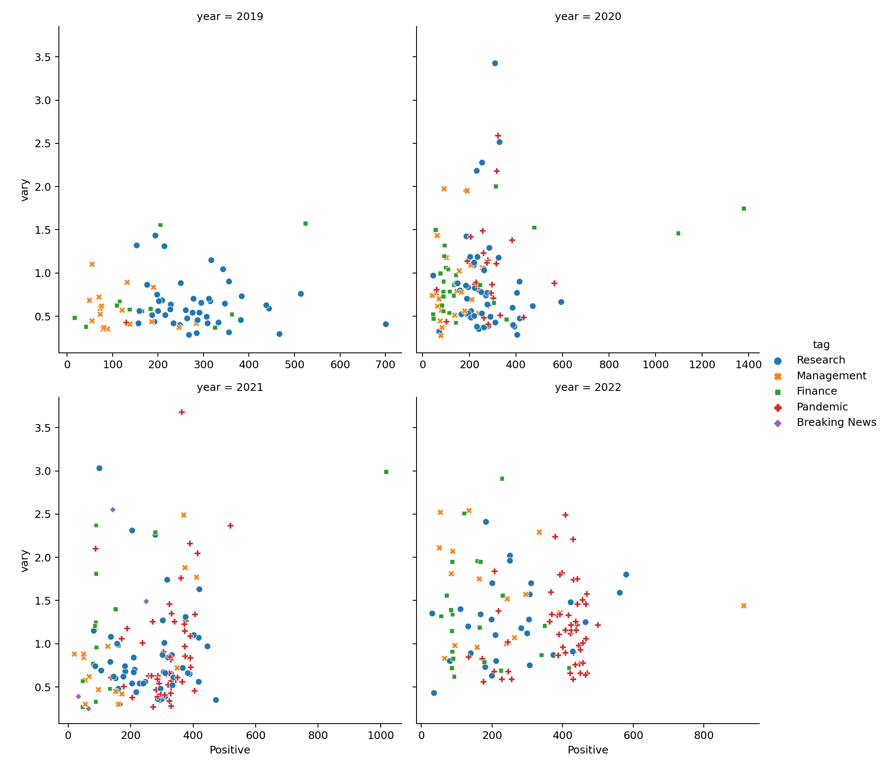
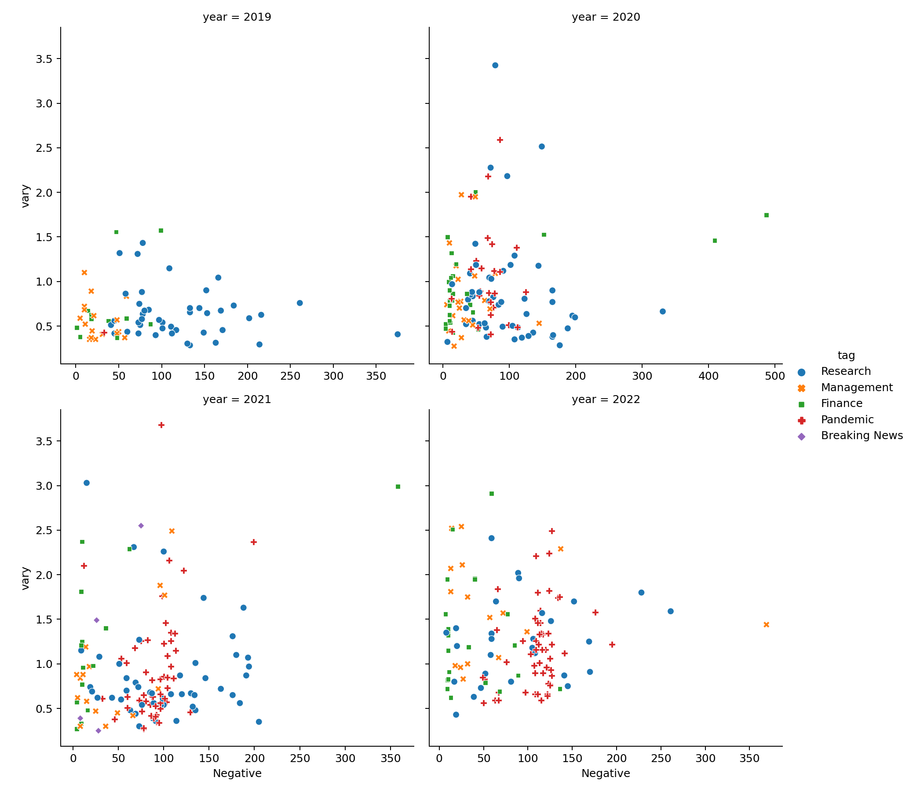
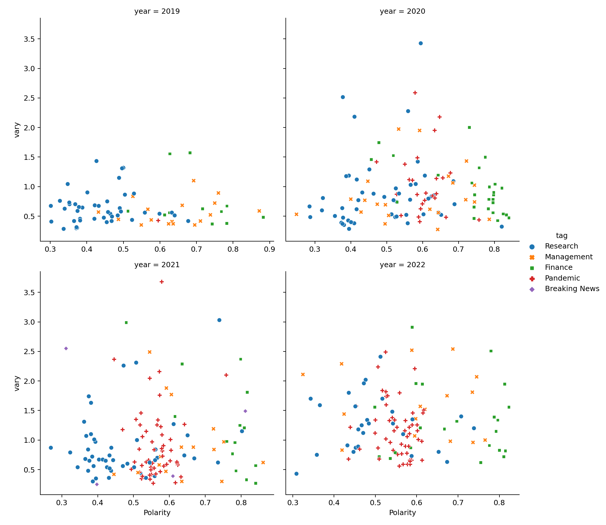
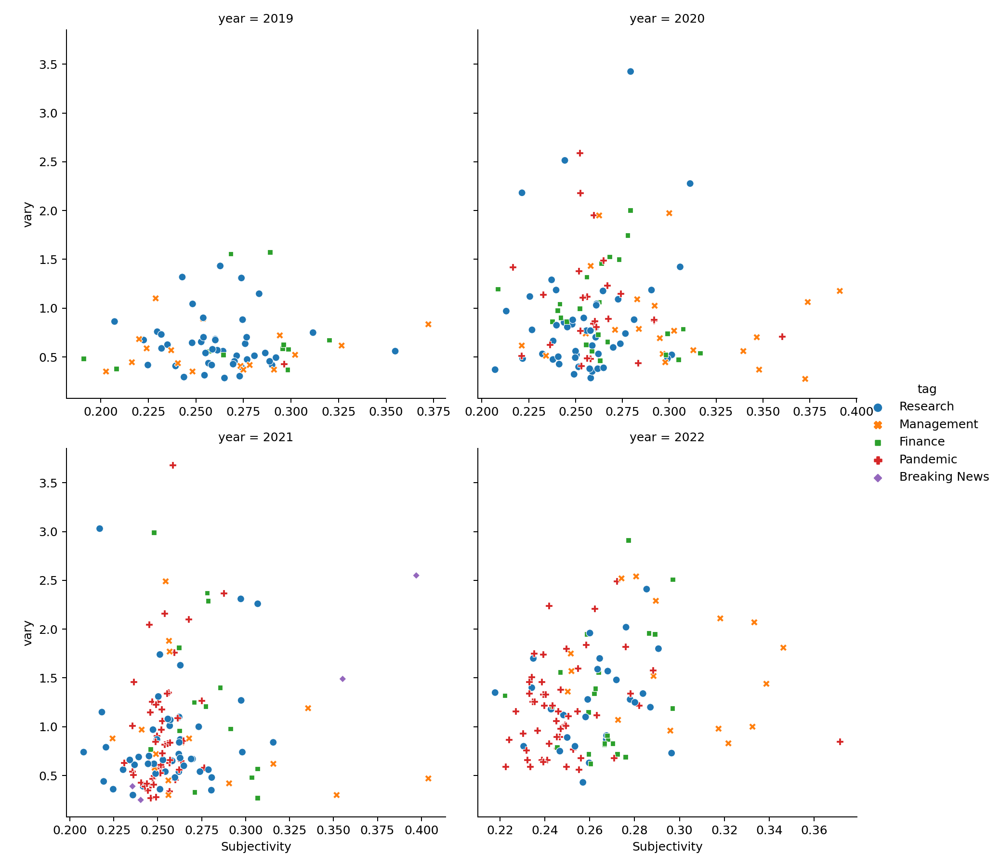

[](http://quantlet.de/)

## [](http://quantlet.de/) **Pfizer_PressRelease_MarketPerformance** [](http://quantlet.de/)

```yaml

Name of Quantlet : Pfizer_PressRelease_MarketPerformance
Published in : DEDA_2022_NYCU
Description : 
- Study the relationship between press release and market performance with the case of Pfizer during the pandemic.
- data is generated described in sub folders
Keywords :
- sentiment analysis
- web scraping
- decision tree
- random forest
- data visualization
- UMAP
- Regression
Data:
- Pfizer_data.csv
OutPut :
- Pfizer_fig1.png
- Pfizer_fig2.png
- Pfizer_fig3.png
- Pfizer_fig4.png
Submitted:  '05 Dec 2022'
Author : 
- 'Tracy Zhou'
- 'Youcef Tahari'
- 'Buris Muangklang'
- 'Wolfgang Karl Härdle'

```









### PYTHON Code
```python

# -*- coding: utf-8 -*-
"""
Created on Mon Dec  5 17:49:48 2022

@author: Tracy Zhou
"""

import os
import pandas as pd
import numpy as np
import matplotlib.pyplot as plt
import seaborn as sns

# check directory
os.getcwd()

data = pd.read_csv("Pfizer_data.csv")
data.head()

data.describe()

plt.plot(data.date,data.AdjClose)
#plt.plot(data.news_time,data.Negative, color = "blue")
plt.xlabel('Date')
plt.title('Pfizer Stock price')
plt.xticks(np.arange(0, len(data), 360), fontsize=12)
#plt.savefig("Pfizer_Stock_Price.png", transparent = True, dpi=180)
plt.show()

plt.figure(figsize=(16,9))
plt.plot(data.date,data.trends)
plt.xlabel('date')
plt.xticks(np.arange(0, len(data), 360), fontsize=12)
plt.savefig("Pfizer_trends.png", transparent = True, dpi=180)


data = data[data['year'] > 2018]
sns.relplot(
    data=data,
    x="Positive", y="vary", col="year",
    hue="tag", style="tag", 
    col_wrap = 2,
    facet_kws=dict(sharex=False),
)
plt.savefig("Pfizer_fig1.png", transparent = True, dpi=180)
sns.relplot(
    data=data,
    x="Negative", y="vary", col="year",
    hue="tag", style="tag", 
    col_wrap = 2,
    facet_kws=dict(sharex=False),
)
plt.savefig("Pfizer_fig2.png", transparent = True, dpi=180)
sns.relplot(
    data=data,
    x="Polarity", y="vary", col="year",
    hue="tag", style="tag", 
    col_wrap = 2,
    facet_kws=dict(sharex=False),
)
plt.savefig("Pfizer_fig3.png", transparent = True, dpi=180)
sns.relplot(
    data=data,
    x="Subjectivity", y="vary", col="year",
    hue="tag", style="tag", 
    col_wrap = 2,
    facet_kws=dict(sharex=False),
)
plt.savefig("Pfizer_fig4.png", transparent = True, dpi=180)

```

automatically created on 2022-12-07